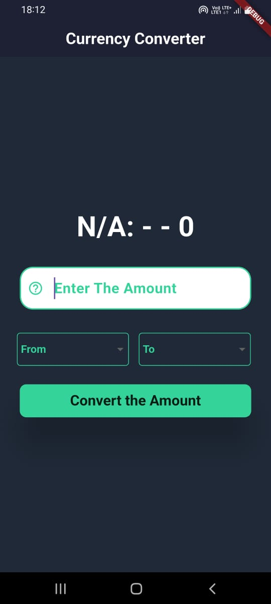
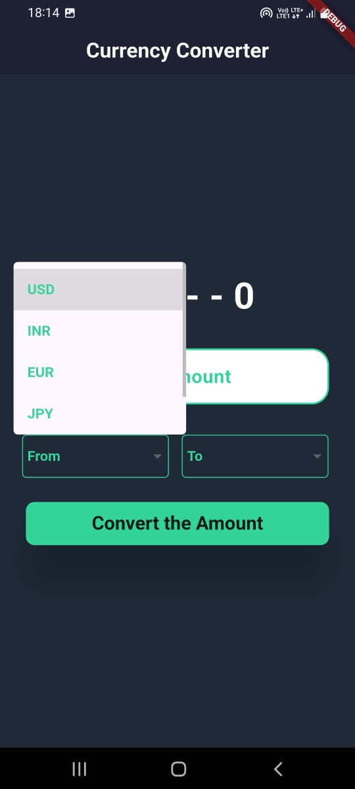
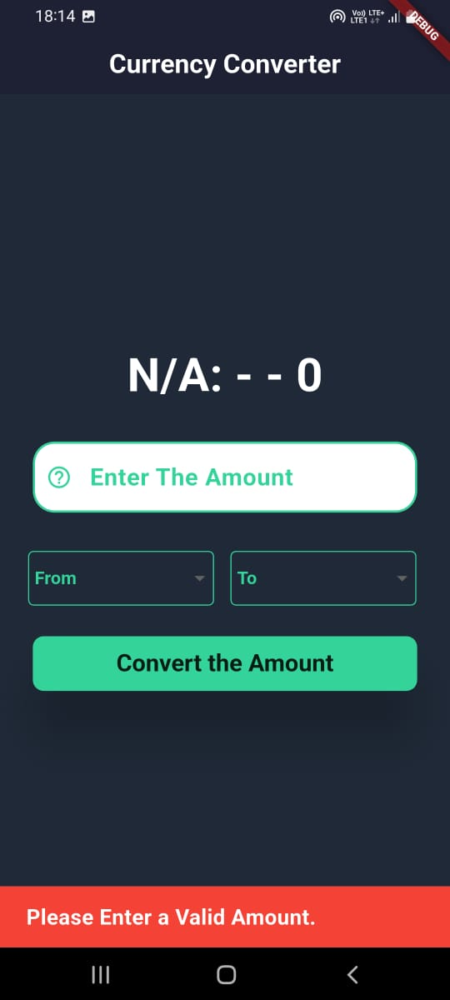

## 💱 Currency Converter App (Flutter)

*A simple and user-friendly Currency Converter mobile application built using Flutter and a Currency Exchange Rate API.*
*The app allows users to convert amounts between popular currencies with proper validation and error handling.*

**🚀 Features**
   1. 🔢 Enter amount to convert

   2. 🌍 Supports multiple currencies:

        - USD (US Dollar)

        - INR (Indian Rupee)

        - EUR (Euro)

        - JPY (Japanese Yen)

        - GBP (British Pound)

   3. 🔄 Select From and To currencies

   4. ⚡ Real-time exchange rates using API

   5. ❌ Handles edge cases:

        - Empty amount input

        - Invalid numeric input

        - Currency not selected

        - API or network errors

   6. 📱 Clean and responsive UI

**🛠️ Tech Stack**
   - Flutter

   - Dart

   - Exchange Rate API

   - HTTP package

**📸 Screenshots**
## 🏠 Initial Screen

## 💱 Currency Conversion Screen

## 🌍 See Total Currencies

## ⚠️ Error Handling Screen

**⚙️ How It Works**
   1. User enters an amount.

   2. Selects a From Currency and a To Currency.

   3. App fetches live exchange rates from the API.

   4. Converted amount is displayed instantly.

   5. Input validation ensures smooth user experience.

**📦 Installation**
   1. Clone the repository: git clone https://github.com/Sourabh108-Coder/Currency_Converter_Flutter.git

   2. Navigate to the project folder: cd currency_converter

   3. Install dependencies: flutter pub get

   4. Run the app: flutter run

**🔑 API Setup**
   1. Get an API key from your preferred Exchange Rate API provider.

   2. Add your API key in the project by creating environment variables inside .env file.

**🧪 Validation & Error Handling**
   - Prevents conversion when input is empty.

   - Ensures valid numeric values.

   - Requires both currency selections.

   - Displays user-friendly error messages.

   - Handles API and network failures gracefully.

**🤝 Contributing**
Contributions are welcome!
Feel free to fork this repository and submit a pull request.

**👨‍💻 Author**
   *- Sourabh (https://github.com/Sourabh108-Coder/)*

  
